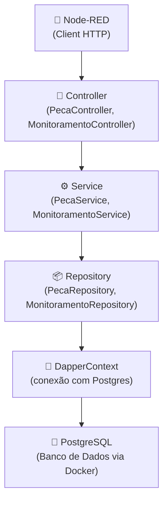

# 🧠 Projeto de Monitoramento de Peças

Este projeto é uma API desenvolvida em **.NET 9** com acesso a banco de dados **PostgreSQL (via Docker)**, utilizando **Dapper** para consultas SQL. A arquitetura segue o padrão de separação em camadas (Controllers, Services, Repositories) e está preparada para integração com o **Node-RED**.

---

## 📀 Arquitetura do Projeto



---

## 🚀 Como rodar o projeto

### 1. Clonar o repositório

```bash
git https://github.com/DevelopmentIOT3SEM/DevelopmentIOT.git
cd DevelopmentIOT
```

### 2. Subir o banco com Docker

Certifique-se de ter o **Docker** instalado. Execute:

```bash
docker-compose up -d
```

> Isso criará os containers do `PostgreSQL` (porta `5433`) e `pgAdmin` (porta `5052`).

### 3. Acessar o banco via pgAdmin

- URL: http://localhost:5052  
- Email: `admin@admin.com`  
- Senha: `admin`  
- Conexão:
  - Host: `host.docker.internal` (Windows) ou `localhost` (Linux)
  - Porta: `5433`
  - Usuário: `admin`
  - Senha: `admin`
  - Banco: `pecasdb`

### 4. Criar as tabelas manualmente

No pgAdmin, execute:

```sql
CREATE TABLE peca (
    id_peca SERIAL PRIMARY KEY,
    tipo_peca VARCHAR(255) NOT NULL
);

CREATE TABLE monitoramento (
    id_monitoramento SERIAL PRIMARY KEY,
    id_peca INT REFERENCES peca(id_peca),
    esteira_on_off BOOLEAN,
    atuador_on_off BOOLEAN,
    qtde_r1 INT,
    qtde_r2 INT,
    qtde_descartada INT,
    data_hora_monitoramento TIMESTAMP DEFAULT CURRENT_TIMESTAMP,
    erros INT
);
```

---

## ⚙️ Rodar a API

### 1. Restaurar pacotes e rodar o projeto

```bash
dotnet restore
dotnet run
```

A API estará disponível em:  
📍 `http://localhost:5271/swagger`

---

## 🔌 Endpoints principais

### 📦 `/api/Peca`
- `GET /api/Peca` → Lista todas as peças
- `POST /api/Peca` → Cria uma peça (retorna o ID criado)

### 📈 `/api/Monitoramento`
- `GET /api/Monitoramento` → Lista os registros de monitoramento
- `POST /api/Monitoramento` → Registra um novo monitoramento

---

## 🪠 Testando com Node-RED

1. Abra o Node-RED (porta padrão: `1880`)
2. Adicione um nó `inject` e um `http request`
3. Configure a URL para:  
   `http://localhost:5271/api/Peca`
4. Conecte a um nó `debug`
5. Clique em "inject" → se configurado corretamente, verá a resposta no debug.

---

## 📁 Estrutura de Pastas

```
📂 PecaMonitoramentoAPI
│
├── Controllers/
│   └── PecaController.cs
│   └── MonitoramentoController.cs
│
├── Services/
│   └── Interfaces/
│   └── PecaService.cs
│   └── MonitoramentoService.cs
│
├── Repositories/
│   └── Interfaces/
│   └── PecaRepository.cs
│   └── MonitoramentoRepository.cs
│
├── Models/
│   └── Peca.cs
│   └── Monitoramento.cs
│
├── Data/
│   └── DapperContext.cs
│
├── docker-compose.yml
└── appsettings.json
```

---

## 📦 Tecnologias usadas

- .NET 9
- Dapper
- PostgreSQL
- Docker + Docker Compose
- pgAdmin 4
- Node-RED (futuro gateway)
- Swagger para documentação

---


