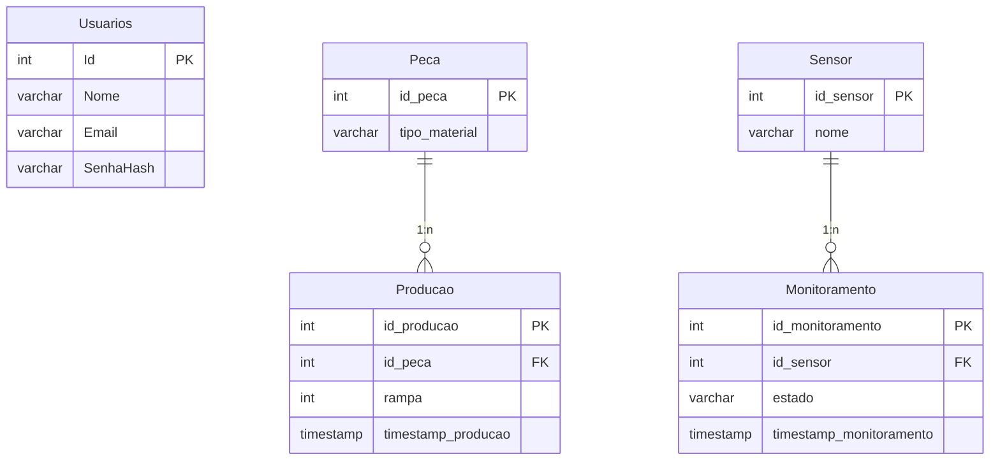

```mermaid
erDiagram
    Usuarios {
        int Id PK
        varchar Nome
        varchar Email
        varchar SenhaHash
    }

    Peca {
        int id_peca PK
        varchar tipo_material
    }

    Sensor {
        int id_sensor PK
        varchar nome
    }

    Monitoramento {
        int id_monitoramento PK
        int id_sensor FK
        varchar estado
        timestamp timestamp_monitoramento
    }

    Producao {
        int id_producao PK
        int id_peca FK
        int rampa
        timestamp timestamp_producao
    }

    Sensor ||--o{ Monitoramento : "1:n"
    Peca ||--o{ Producao : "1:n"

```