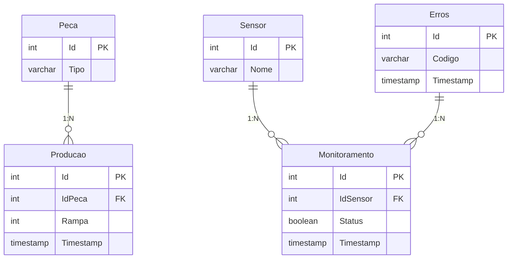

```mermaid
erDiagram

    Peca {
      int Id PK
      varchar Tipo
    }

    Sensor {
      int Id PK
      varchar Nome
    }

    Erros {
      int Id PK
      varchar Codigo
      timestamp Timestamp
    }

    Monitoramento {
      int Id PK
      int IdSensor FK
      boolean Status
      timestamp Timestamp
    }

    Producao {
      int Id PK
      int IdPeca FK
      int Rampa
      timestamp Timestamp
    }

    Peca ||--o{ Producao : "1:N"
    Sensor ||--o{ Monitoramento : "1:N"
    Erros ||--o{ Monitoramento : "1:N"


```